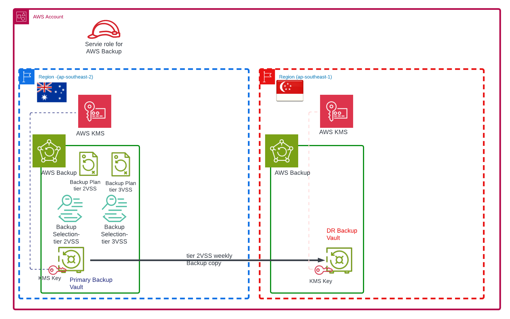

# Overview  

Please see blog site https://devbuildit.com/2023/03/10/aws-backup-windows-ec2-instance-part-1/ for detailed explaination of this repo contents.

This repo (and associated blog) will help you to deploy some AWS components used for AWS backup and restore.

## Requirements:
- AWS Account
- Terraform CLI installed with access to your target AWS account

## Deployment
- Clone repo into folder
- Run command 'Terraform init' 
- Run command 'Terraform plan' 
- Run command 'Terraform apply' and type 'yes' to confirm deployment

